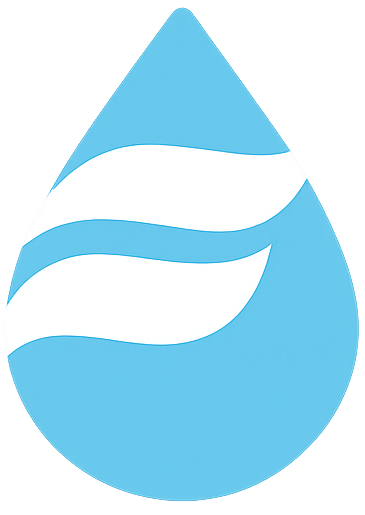

<p align="center">
  
</p>

<h1 align="center">Go Flume API Client</h1>
<h3 align="center">A Go client for the Flume Personal API.</h3>
<p align="center">
  
  <a href="https://github.com/401unauthorized/go-flume#readme" target="_blank">
    
  </a>
  <a href="https://github.com/401unauthorized/go-flume/graphs/commit-activity" target="_blank">
    
  </a>
  <a href="https://github.com/401unauthorized/go-flume/graphs/commit-activity" target="_blank">
    
  </a>
  <a href="https://github.com/401unauthorized/go-flume/blob/master/LICENSE" target="_blank">
    
  </a>
  <a href="https://paypal.me/stephenmendez401" target="_blank">
    
  </a>
</p>

---

## 📋 Table of Contents

- [Overview](#-overview)
- [Features](#-features)
- [Installation](#-installation)
- [Usage](#-usage)
- [Authentication](#-authentication)
- [API Methods](#-api-methods)
- [License](#-license)
- [Disclaimer](#-disclaimer)

---

## 👀 Overview

go-flume is an idiomatic Go client designed to interact with the Flume Personal API. 

The Flume Personal API enables developers to create custom tools and integrations for managing their Flume devices. It is intended solely for personal use.

The API is still being actively developed and is subject to change at any time.

For official API documentation, see:  
https://flumetech.readme.io/reference/introduction

---

## 🎛 Features

- **OAuth2 authentication**
- **Comprehensive API coverage**: Query user, device, usage, flow, location, budget, subscription, notification, alert, contact, and rule data
- **Flexible query parameters**: Some methods accept optional parameter structs for filtering, sorting, and pagination
- **Idiomatic Go types**: Strongly typed models for all API resources
- **Robust error handling**: All methods return error values
- **Easy integration**: Simple client setup and usage with context support
- **Actively maintained** and well-documented

---

## 💾 Installation

Install the package using `go get`:

```bash
go get github.com/401unauthorized/go-flume
````

---

## 🚀 Usage

### 1. Create the Client

```go
import (
    "context"
    "log"
    goflume "github.com/401unauthorized/go-flume"
)

func main() {
    client := goflume.NewClient(
        "your-client-id",
        "your-client-secret",
        nil, // Use default HTTP client
    )

    // Authenticate
    err := client.Authenticate(context.Background(), "your-username", "your-password")
    if err != nil {
        log.Fatal("Authentication failed:", err)
    }

    // Example: Get user info
    user, err := client.GetUser(context.Background())
    if err != nil {
        log.Fatal("GetUser failed:", err)
    }
}
```

---

## 🔐 Authentication

* `Authenticate(ctx, username, password) error`
  Authenticate with Flume username and password.

* `RefreshAccessToken(ctx) error`
  Refresh the access token using the refresh token.

  > The client does not handle token refreshes when making API calls, so you need to call this manually.

---

## 🛠 API Methods

All methods accept a `context` and return a structured result and an error.

### User

* `GetUser(ctx) (*UserResponse, error)`

### Devices

* `GetDevices(ctx, params *DevicesParams) (*DevicesResponse, error)`
* `GetDevice(ctx, deviceID string, params *DeviceParams) (*DeviceResponse, error)`

### Usage & Flow

* `QueryUsage(ctx, deviceID string, req QueryUsageRequestBody) (*QueryUsageResponse, error)`
* `GetCurrentFlow(ctx, deviceID string) (*FlowResponse, error)`

### Locations

* `GetLocations(ctx, params *GetLocationsParams) (*LocationsResponse, error)`
* `GetLocation(ctx, locationID string) (*LocationResponse, error)`
* `UpdateLocation(ctx, locationID string, patch LocationPatch) (*APIResponseEnvelope, error)`

### Budgets

* `GetBudgets(ctx, deviceID string, params *GetBudgetsParams) (*BudgetsResponse, error)`

### Subscriptions

* `GetSubscriptions(ctx, params *GetSubscriptionsParams) (*SubscriptionsResponse, error)`
* `GetSubscription(ctx, subscriptionID string) (*SubscriptionResponse, error)`

### Notifications

* `GetNotifications(ctx, params *GetNotificationsParams) (*NotificationsResponse, error)`

### Alerts

* `GetUsageAlerts(ctx, params *GetUsageAlertsParams) (*UsageAlertsResponse, error)`

### Event Rules & Usage Alert Rules

* `GetEventRules(ctx, deviceID string, params *GetEventRulesParams) (*EventRulesResponse, error)`
* `GetUsageAlertRules(ctx, deviceID string, params *GetUsageAlertRulesParams) (*UsageAlertRulesResponse, error)`
* `GetUsageAlertRule(ctx, deviceID, ruleID string) (*UsageAlertRuleResponse, error)`

### Contacts

* `GetContacts(ctx, params *GetContactsParams) (*ContactsResponse, error)`

---

## 📝 License

Copyright © 2025 Stephen Mendez

Licensed under the Apache License, Version 2.0 (the "License");
you may not use this file except in compliance with the License.
You may obtain a copy of the License at

http://www.apache.org/licenses/LICENSE-2.0

Unless required by applicable law or agreed to in writing, software
distributed under the License is distributed on an "AS IS" BASIS,
WITHOUT WARRANTIES OR CONDITIONS OF ANY KIND, either express or implied.
See the License for the specific language governing permissions and
limitations under the License.


---

## ⚠️ Disclaimer

This client is **not affiliated** with Flume, Inc.
Use at your own risk.

**Trademark Notices**

Flume, the Flume logo, FlumeTech, HomeHealth, FlumePro, and Get to Know Your H2O are registered trademarks of Flume, Inc. in the United States and FlumeWater is a trademark of Flume, Inc.

All other trademarks referenced herein are the property of their respective owners.